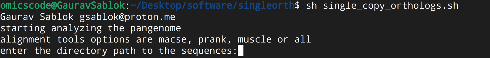

# singleortho

- entire transcriptome assembly annotation pangenomics on single copy genes 
- uses all the alignment tools 
- Alignment -> Alignment Cleaning -> Estimation -> Phylogeny -> Phyloinformatics
- viral phylogenomics added.




```
sh panseq.sh
```

Gaurav Sablok \
gsablok@proton.me
